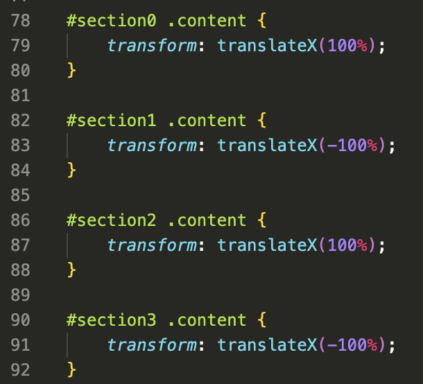
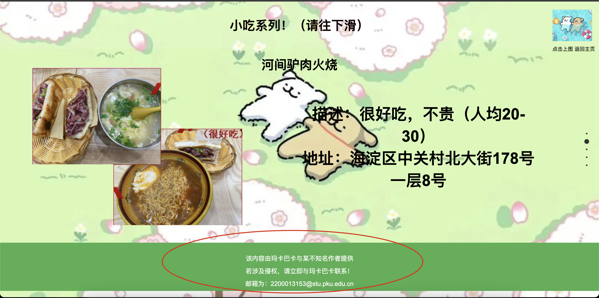
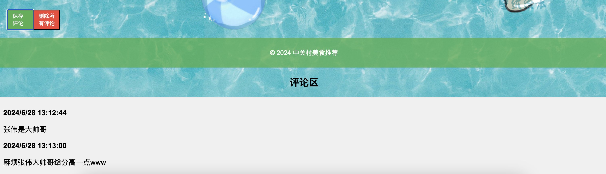
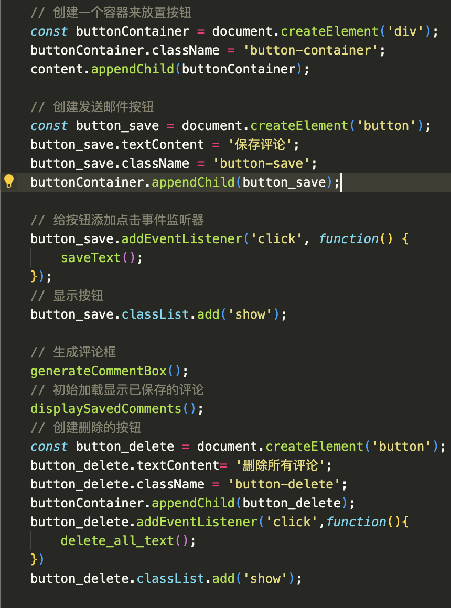

[toc]
# Javascript课设——“中关村附近美食推荐”
项目地址：[中关村附近美食推荐](https://github.com/mkbk-with-circle/JS_Homework-of-.git)
## 引言（Introduction）
### 初衷
其实一开始并没有想好做什么，坦白的说这个大作业确实并不是一个“长线作战”的工程，本来是希望参与到某个JS工程里去搞搞开发的，但是没有找到合适的；转眼来到了期中后期末前又没有很多时间投入开发，所以最后选择自己开发一个小网页。刚好前段时间有朋友给我转发了一个名为“中关村附件美食推荐”的pdf文件，把正在复习JS（当时还真在复习JS）的我硬控了一个小时去和同学讨论这些吃的，然后就萌发了把这个做成一个网页的想法，并且以后可以不断完善成一个比较好的网页的话，何尝不是造福广大PKU民众呢？因此便开始着手搞这个网页。

### 主要功能介绍
网页功能很简单，主要分为了五个页面
1. 主页面，用来进行跳转和搜索（尚未实现）
2. 小吃系列页面
3. 洋餐系列页面
4. 中餐系列页面
5. 自助系列页面
   
每个页面有自己的食物介绍和评价、价格及其地址。同时也可以进行相互跳转
在主页面的底下还有一个评论区，本来想做一个挂在服务器上的可以共享评论的但是没做出来，只能做一个保留在本地的。


## 设计方案（Design Plan）
整个Web设计只有前端设计没有后端。
分为了一个页面和四个分页面，相对独立地进行开发，其中四个分页面采用了两种排版方式。分别实现了:
1. 页面进入视框和退出视框之后的自滑动效果
2. 带有页码的滑动效果
然后分别在每个页面加上一个跳转到首页的按钮实现相互跳转。

## 关键功能的实现步骤和代码示例（Code Displaying）

### 页面进入退出视框时的自滑动效果
[视频示例](中餐系列/中餐系列.mp4)
#### html页面布局
该页面的布局主要是直接在html文件中进行布局，逻辑很简单，代码如下：
```html
<div class="section" id="section3">
        <div class="content">
            <div class="grid-container">
                <div class="grid-item area1-2"><h1>京华烟云·北京牡丹烤鸭&京菜</h1></div>
                <div class="grid-item area3">
                    <div class="photo-container">
                        
                        
                    </div>
                </div>
                <div class="grid-item area4">
                    <div class="text">
                        <p>描述：很好吃，不贵（人均80+）</p>
                        <p>地址：海淀区丹棱街甲1号领展购物广场6号601-02号</p>
                    </div>
                </div>
            </div>
        </div>
    </div>
```
这是对一家商店的介绍，我用了class="section"来对所有的商家做css中统一的格式调整:
```css
.section {
    height: 100vh;
    display: flex;
    justify-content: center;
    align-items: center;
    position: relative;
    background-color: rgba(255, 255, 255, 0.1); /* 半透明白色背景 */
}
```
对于不同的id，本质上是因为在页面滑动时，我实现了交替从左从右滑出的效果，在观感上会更好

在section内部，我分为了三个部分，分别为："grid-item area1-2","grid-item area 3","grid-item area 4"，分别对应每个section的"标题"，"图片"，"描述与地址"，通过在css那一章学的网格布局知识，我在css中是这样设计的：
```css
.grid-container {
    width: 100%;
    height: 100%;
    display: grid;
    grid-template-columns: 2fr 3fr;
    grid-template-rows: 1fr 4fr;
    gap: 20px;
}

.area1-2 {
    grid-column: 1 / span 2;
    text-align: center;
}
```
|    1    |     2    |
|    3    |     4    |
实现了标题占据1,2而图片3，描述4
另外还有一些间距之类的调起来略微麻烦一些
#### js动画
动画只用了一个函数：
```js
document.addEventListener('DOMContentLoaded', () => {
    const sections = document.querySelectorAll('.section');

    const observer = new IntersectionObserver((entries) => {
        entries.forEach(entry => {
            if (entry.isIntersecting) {
                entry.target.querySelector('.content').classList.add('in-view');
            } else {
                entry.target.querySelector('.content').classList.remove('in-view');
            }
        });
    }, {
        threshold: 0.1
    });

    sections.forEach(section => {
        observer.observe(section);
    });
});
```
先获取所有的`section`类，然后用一个`foreach`函数分别调用一次observe函数，实现：当处于`isIntersecting`状态时就加上一个`in-view`的类同时在css中有：
```css
.in-view {
    transform: translateX(0) !important;
    opacity: 1 !important;
}
```
故可以实现自动切入
若`isIntersecting`判定为否，则去除该`in-view`类实现自动切出
### 页面滚动和字幕
[视频演示](小吃系列/小吃系列.mp4)
#### 字幕
在第一面我搞了一个类似电影字幕的页面，即实现字幕能随机从左边/右边的某一个高度出现然后移至中间，停留2s后自动向反方向移动。html中的代码如下：
```html
<div class="section" id="section1">
            <!-- 第一页内容 -->
            <div class="container1">
                <div class="sentence" data-text="俗话说:民以食为天，食以味为先"></div>
                ...
            </div>
        </div>
```
是使用了一个section1和container1来进行整体管理，其动画实现主要在js和css中
js中相关的代码如下：(有一些只列出函数名)
```js
document.addEventListener('DOMContentLoaded', () => {
    const sentences = document.querySelectorAll('.sentence');
    const container = document.querySelector('.container1');
    function randomPosition() {//实现随机高度
        return (Math.random() * 400) + 'px'; // 50px 是句子的高度近似值
    }
    function animateSentence(sentence) {
        const fromLeft = Math.random() < 0.5;
        const animationIn = fromLeft ? 'slideInLeft' : 'slideInRight';
        const animationOut = fromLeft ? 'slideOutRight' : 'slideOutLeft';

        sentence.style.top = randomPosition();
        sentence.style.animation = `${animationIn} 2s cubic-bezier(0.25, 0.1, 0.25, 1.0) forwards`;
        setTimeout(() => {
            sentence.style.animation = `${animationOut} 2s cubic-bezier(0.25, 0.1, 0.25, 1.0) forwards`;
        }, 1500); // 句子停留的时间
    }
    function showSentences() {
        sentences.forEach((sentence, index) => {
            setTimeout(() => {
                sentence.textContent = sentence.getAttribute('data-text');
                animateSentence(sentence);
            }, index * 1500); // 每隔5秒显示一个句子
        });
    }
    showSentences();
    // 循环显示句子
    setInterval(showSentences, sentences.length * 1500);
});
```
另外再css中也定义了动画的具体行为：
```css
/* 定义从左边进入的动画 */
@keyframes slideInLeft {
    0% { transform: translateX(-100vw); opacity: 1; } /* 从视窗左侧外开始 */
    60% { transform: translateX(10%); opacity: 1; }
    100% { transform: translateX(0vw); opacity: 1; }
}
/* 定义从右边进入的动画 */
@keyframes slideInRight {
    0% { transform: translateX(100vw); opacity: 1; } /* 从视窗右侧外开始 */
    60% { transform: translateX(-10%); opacity: 1; }
    100% { transform: translateX(0vw); opacity: 1; }
}
/* 定义从左边退出的动画 */
@keyframes slideOutLeft {
    0% { transform: translateX(0vw); opacity: 1; }
    40% { transform: translateX(10%); opacity: 1; }
    100% { transform: translateX(-100vw); opacity: 0; } /* 移动到视窗左侧外 */
}
/* 定义从右边退出的动画 */
@keyframes slideOutRight {
    0% { transform: translateX(0vw); opacity: 1; }
    40% { transform: translateX(-10%); opacity: 1; }
    100% { transform: translateX(100vw); opacity: 0; } /* 移动到视窗右侧外 */
}
```
至此实现了弹幕自动弹出和切出
#### 页面滚动
和刚刚的字幕一样，也是在html中使用scetion和container进行封装处理，并且也实现了网格布局
```html
<div class="section" id="section2">
            <div class="container">
                <div class="grid-item title"><h1>河间驴肉火烧</h1></div>
                <div class="grid-item image"></div>
                <div class="grid-item text">
                    <div class="text-content">
                        <p>描述：很好吃，不贵（人均20-30）</p>
                        <p>地址：海淀区中关村北大街178号一层8号</p>
                    </div>
                </div>
            </div>
        </div>
```
也是分为了三个网格部分，在css中则是将比例划分为：
```css
.container {
    display: grid;
    grid-template-areas:
        "title title title title"
        "image text text text";
    grid-template-columns: 1fr 2fr;
    ...
}
```
关于js中的控制函数主要为：
```js
const elementInView//判断该section是否进入视框
const displayScrollElement//加上“scrolled”的标识，用于启动动画
const hideScrollElement//去除“scrolled”的标识，用于结束动画
const handleScrollAnimation
```
其逻辑就是通过elementInView判断true or false，然后要么调用hideScrollElement要么调用displayScrollElement函数

#### 返回按钮和底部
返回按钮，每个页面都配备了一个，实现起来很简单
```html
<div class="back-container">
        <button class="back-button" onclick="location.href='../index.html'"></button>
        <span class="back-text" style="font-size: 13px;">
            点击上图
            返回主页   
        </span>
    </div>
```
加个超链接即可！然后在css中加一个背景图片即可，这里不展示代码了

底部

用一个footer标识
```html
 <footer>
        <p>该内容由玛卡巴卡与某不知名作者提供</p>
        <p>若涉及侵权，请立即与玛卡巴卡联系！</p>
        <p>邮箱为：2200013153@stu.pku.edu.cn</p>
    </footer>
```
在html中与内容`fullpage`同级，所以可以一直保持在页面下方，css中也调整了透明度等属性

### 评论区

完全在js中实现而不是html
1. 创建评论区
```js
// 创建并添加一个文本框到页面底部
    const textBox = document.createElement('textarea');
    textBox.placeholder = '在此输入您的评论,您的评论会被保存到当地缓存中，只要您不清除缓存记录就不会消失！';
    textBox.className = 'text-box';
    content.appendChild(textBox);
    textBox.rows = 4; // 设置文本框的行数
    textBox.cols = 50; // 设置文本框的列数
```
2. 创建保存和删除评论的按钮
   
3. 三个关键函数：
   ```js
   function saveText() {}
   function displaySavedComments() {}
   function delete_all_text(){}
   ```
   实现了保存评论，展示评论，删除评论

## 测试方法
整个项目的完成过程都仅仅在vscode上进行，由于这是一种具有函数优先的轻量级，解释型或即时编译型的编程语言。所以调试过程就是写一会代码然后把html在Chrome上打开看看效果，然后用`command + f12`看看控制台有什么报错没有x
测试方法很古老但是感觉也只能这样了，可能也因为我没有用其他的包或者更方便的ui，导致只能这样去不断调试。还好是分成了几个部分分别建立Web，调试起来不会过于复杂。
## 附录/参考
主要参考了：
[JavaScript 实现页面滚动动画](https://blog.csdn.net/qq_43667836/article/details/122409887?ops_request_misc=%257B%2522request%255Fid%2522%253A%2522171955282316800185864251%2522%252C%2522scm%2522%253A%252220140713.130102334..%2522%257D&request_id=171955282316800185864251&biz_id=0&utm_medium=distribute.pc_search_result.none-task-blog-2~all~top_positive~default-1-122409887-null-null.142^v100^pc_search_result_base7&utm_term=%E9%A1%B5%E9%9D%A2%E6%BB%9A%E5%8A%A8&spm=1018.2226.3001.4187)
[js 实现自动滚动 缓慢滚动元素到可视区域](https://blog.csdn.net/qq_41429765/article/details/127177756?ops_request_misc=&request_id=&biz_id=102&utm_term=%E9%A1%B5%E9%9D%A2%E6%BB%9A%E5%8A%A8js&utm_medium=distribute.pc_search_result.none-task-blog-2~all~sobaiduweb~default-3-127177756.142^v100^pc_search_result_base7&spm=1018.2226.3001.4187)
[使用JavaScript实现页面滑动切换效果](https://blog.csdn.net/lwf3115841/article/details/132191671?ops_request_misc=&request_id=&biz_id=102&utm_term=js%E9%A1%B5%E9%9D%A2%E6%BB%9A%E5%8A%A8&utm_medium=distribute.pc_search_result.none-task-blog-2~all~sobaiduweb~default-7-132191671.nonecase&spm=1018.2226.3001.4187)
[chatgpt友情帮助](https://chatgpt.com/)
[张伟大哥的课件](https://course.pku.edu.cn/webapps/blackboard/content/listContent.jsp?course_id=_67531_1&content_id=_1128694_1&mode=reset)
## 总结与展望
依然是很抱歉这个大作业不得不在期末之后仓促地完成，本意还是希望这个网页可以给广大同学老师带来便利，可以根据需要选择想吃的东西。本学期期末前没怎么写过js代码，我的项目虽然没什么技术含量但是也让我感受到了通过js制作一个Web网页的“不简单”之处，就是看上去一个很简单的网页布局，实际写起代码来让它最后能呈现想要的效果实在是不容易，整个项目其实花了很多时间在排版上。然后想要实现动态效果就是写js的函数，清楚整个函数逻辑之后写起来反而快一些。

其实还有很多想实现的东西，比如在页面上多增添一些效果，如加上页码，可以点击图片翻动图片（类似大众点评），可以自己加入餐厅及评价（可能涉及到数据库），简易搜索（这个其实简单一些），以及捣鼓了半天没捣鼓出来的就是“意见箱”（即点击按钮后可以自动发送邮件到我的邮箱）。如果以后有时间会继续去实现这些功能，我也已经把项目上传到github上，有缘人自会看到嘿嘿嘿！

最后，再次感谢张伟老师、助教大哥、chatgpt、提供该网页探店内容的不知名友友及其他所有帮助我的人，虽然做出来的东西不咋地但是依然小有成就！感谢！

联系人：玛卡巴卡（元铭宇）
联系方式：手机号13601893399/邮箱：2200013153@stu.pku.edu.cn


# 生活照及签到说明

整个学期的课程应该一共去了9/10次吧🥺🥺🥺。张伟老师的讲课其实我个人觉得很有意思🥹🥹🥹，尤其是课前课后放的音乐（甚至我还把课前放的歌加过自己歌单），只是一方面确实早八不太起得来，另一方面就是张伟老师说了不签到所以就呃呃呃；当然虽然不签到但是翘课还是不好的，我还是会在每个周末去把张伟老师的课程回放看一遍并且在自己的js.md上做好笔记整理。其实我感觉张伟老师上课时比较希望互动的，但是一方面大家来的人少另一个早八可能没什么欲望去交流，要是以后这门课程可以放在下午七八节课或者再说三四节课相信一定会好很多！
**张伟大哥辛苦力！！！**